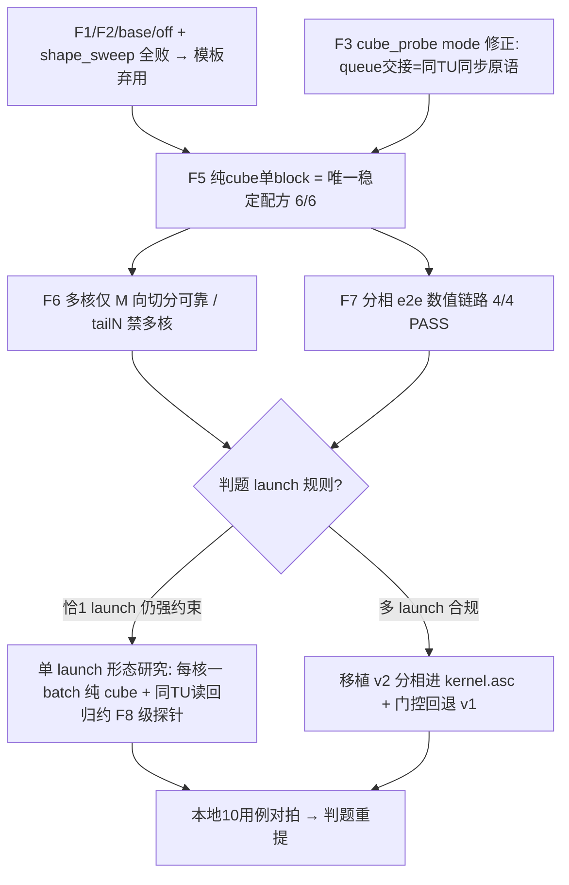

# PLAN_1746 Probe F — matmul 多 tile 迭代 / grid-dim / 消费时序取证备忘

日期：2026-09-08
状态：F1–F7 全量二轮云跑判读收口（commit 7334902 / run_f5f6f7.txt）。唯一稳定配方 = F5 纯 cube 单 block GM 直写（二轮 6/6 PASS 复验）；多核纯 cube 仅 M 向切分可靠（F6）；v2 分相 e2e 数值链路 4/4 PASS（F7）；off_matmul_abs / shape_sweep 模板系弃用。
**决策（2026-09-08）：用户选定「赌判题多 launch 合规」→ commit `788e0db` 已把 F7 分相移植进提交形态 `kernel.asc`**
（fp16 && M,N≥128 门控 → 每 batch v2_cube_batch + v2_reduce_batch 同 stream；其余 bf16/小 shape/tiling 拒/分配失败 → v1 单核兜底；
门控/回退细节见 memory §十二）。
**云跑结果（788e0db，2026-09-08）：两轮全绿 → 判题重提已就绪。** run.sh 10 小用例 ALL PASSED（v1 兜底全过，编译仅无害告警，
matmul/tiling host 头在 template cmake 下可编译链接）；gen_data_big 6/6 PASSED（max diff ≤2.9e-3，c102 512³ 瞬时完成 → 强证据
cube 路径已接管大 shape）。唯一致命待反证项 = 判题多 launch 规则，提交重提见分晓。
关联：PLAN_1746_v3_cube取证_fp16正确路；off_matmul_abs.asc；cube_probe.asc；memory/2026-09-08.md（完整证据与判读）

---

## 一、实验矩阵（本轮已上云）

| ID | 文件 | 模式 | 说明 |
|----|------|------|------|
| F1 | off_matmul_abs.asc | (SetDim=1, numBlocks=1) | 单核整矩阵假设 |
| F2 | off_matmul_abs.asc | (SetDim=2, numBlocks=2) | 规范配对 + 多核 M 切分 |
| base | off_matmul_abs.asc | (SetDim=2, numBlocks=1) | 官方 03.05 原配置（对照，实测 4/40 tile 对位） |
| F3-m2 | cube_probe.asc | mode2 = GetTensorC→EnQue→DeQue/Free→Alloc→Abs→EnQue→DeQue→DataCopy | Abs 移到 queue 交接后作独立二次生产者 |
| F3-m3 | cube_probe.asc | mode3 = GetTensorC→Max(x,x)→EnQue→DataCopy | 非 Abs 的 pre-EnQue vector 消费者 |
| F3-m0/m1 | cube_probe.asc | 保留 | mode0=G 基线 / mode1=P 反例 |

Kernel 均未改动（off kernel 逐字官方；cube_probe 仅增 kernel 入口实例化不同 mode 标量）。

## 二、权威文档/头库事实（研究已核对，含出处）

1. **usedCoreNum 关系**：`usedCoreNum = (M / singleCoreM) * (N / singleCoreN)`（取值 1..最大核数）。
   出处：Documentation_for_Developers .../04.03…ipynb 及 light 03.03…ipynb 的 TCubeTiling 参数表（SetDim/usedCoreNum 行）。
2. **规范 host 配对 = SetDim(numBlocks) 且 launch<<<numBlocks>>>**：
   light 03.03 `matmul_custom_tiling.h`：`GenMatmulTiling(..., numBlocks)` 内 `cubeTiling.SetDim(numBlocks)`；host `matmul_custom<<<BLOCK_DIM,...>>>`（M1024 K256 N640 样例 BLOCK_DIM=1，SetDim=1 一致）。
3. **官方整写 C 的推荐路径 = `IterateAll(cGlobal)`**：`mm.SetOrgShape(...) → SetTensorA/B/Bias → IterateAll(cGlobal) → End()`，框架内部完成全部 tile 并直接写 GM C（light 03.03 Kernel 实现代码 cell L436-495）。
   - 头库出处：matmul_client.h L796-849 `IterateAll(GlobalTensor<DstT>& gm, ...)`，CType 为 GM；内部 `PostMessage<MMFUN_ITERATE_ALL>` + `PrepareABFromGM/Ub`。
4. **manual `Iterate<sync>` 的迭代量语义（核心！）**：matmul_client.h
   - `Init`（L89-96，同 L146-154/L1707-1714）：`nIter_ = Ceil(singleCoreN, baseN)`，`mIter_ = Ceil(singleCoreM, baseM)`，非 partialOutput 时 `mnIter_ = nIter_ * mIter_`。
   - `Iterate`（L685-747）：每 true 一轮一个 tile；`cntIter_` 累计，`++cntIter_ >= mnIter_` 即 false 停；`SetTailIterate`（L248-252）可用 tailM/tailN 覆写 mIter_/nIter_。
   → 即：**每核只自动遍历"自己 singleCoreM×singleCoreN 区"内的 tile 数**；多核切分后的迭代范围对单核不存在隐式扩大。
5. **GetTensorC 属 CopyOut 阶段消费口**（light 03.03 流程：SetTensorA/B→Compute(Iterate)→CopyOut(GetTensorC)）；GetTensorC<sync>(dst, enPartialSum, cubePipeline) 同步模式无 cache。
6. **iterateOrder 参数**（TCubeTiling 表）：0=先沿 M 轴偏移再 N 轴；1=先沿 N 轴再 M 轴。GetTensorC 的 tile 归属 C 矩阵的偏移按该顺序自动进行。
7. **单 tile 尺寸**：一次 Iterate = [baseM, baseN] C 分片。
8. **DataCopy gap/pitch 128B 块语义**：已由 copy_sem_probe R0-R2 实测验证（行距=(gap+列块)×32B），可直接信赖。

## 三、待判定问题（云跑后逐项勾销）

- [x] Q-A 规范配对 (1,1)/(2,2) 是否全 C 100% 对？→ **否**（off 系 mix kernel 全错，F1/F2 bad≈95%）→ recipe 收敛到纯 cube 文件形态，而非 SetDim 配对。
- [x] Q-B 单 block 却写 rows512+ 的来源：**归档**。off 系问题已整体归因「vector 参与 C 消费路径」，rows512+ 为同根错写的组成部分，不再单独定性。
- [x] Q-C vector 消费时机（mode2/mode3）能否修复 → **否**：mode0/1/2/3 四态同构 GGPP，GetTensorC→vector 消费 = 跨次不稳竞态，弃用。
- [x] Q-D mode0 main row32=S 成因 → 同根竞态，归档。
- [x] Q-E（F5 新增）官方 03.03 纯 cube（ASCENDC_CUBE_ONLY+__cube__+CType GM+IterateAll GM-C）是否全对 → **6/6 有效 shape 全 PASS、0 mismatch**（tailN=1000、Ktail=200 亦过）；M<baseM/N<baseN TILING_FAIL = shape 门控边界。
- [x] Q-F（F6）纯 cube 多核拼写 → **仅 M 向切分 PASS**：off1（CalcOffset）必须 + SetDim==numBlocks + host C 清零；
  off0（不偏移）→ 双核重叠写 rows0..511、rows512..1023 恒 0（半张零）。M2048/N320 nb4 off1、M1024/N640 nb2 off1
  均 bad=0；**tailN（N=1000）多核必炸**（tiling 逼出 N 向切分 scN=504/1024 → 巨大垃圾错值）→ 多核只可靠于每核整 N 宽；
  tailN 仅单核整 N 可靠（F5/F7 已覆盖）。
- [x] Q-G（F7）v2 分相端到端 → **4/4 PASS**（M256N640K256/B2、M128N1000K200/B3 tailN+Ktail、M1024N320K256/B1、
  M512N1000K256/B2；unbias，tol 1e-3）→ 分相数值链路成立。注意：独立进程内 host 顺序 launch 验证，**非判题 harness 的
  launch 合规验证**（多 launch 是否违规仍悬置，见 §四未决风险）。

## 四、2026-09-08 晚收口：F 结论 + v2「分相」架构（完整证据与判读见 memory/2026-09-08.md）

- **F1/F2/base/F4 全败 + cube_probe mode0..3 同构退化 → 根因 = 凡 matmul C 读出经 vector 侧（GetTensorC→vector）即竞态**；SetDim 配对不是变量（F5 同 shape 全对证伪配对问题）。
- **唯一稳定配方 = F5 纯 cube 单 block 形态**（ASCENDC_CUBE_ONLY + `__cube__` + CType GM + `IterateAll(cGlobal)`，全文件无 vector 部件）。
- **v2 架构 = 分相**：相① 纯 cube 整写 batch 的 M×N fp32 C → GM workspace；相② 独立 `__aicore__` vector 核读 C 归约 y[b]（惯用法逐字取自 v1 kernel.asc：64-chunk masked DataCopyPad + ReduceMax/Max fold + acc count-1 Add + 4B 写）；host 逐 batch 顺序 launch，同 stream 排序。原「单 launch C-tile 行归约不落 GM」因依赖 GetTensorC 竞态通道而废弃。
- **未决风险（勿丢）**：判题平台曾实测「每 iteration 恰 1 launch」（Expected 75）；v2 每 batch 2 launch 是否仍合规未知 → 待赛方口径/判题探针；不赌多 launch 前提下备「单 launch」替代形态研究。
- Host 基础：`SetDim(numBlocks)` 且 launch grid==numBlocks（F6 待实测纯 cube 多核拼写）；workspace=GetLibApiWorkSpaceSize()；C 落 GM 前清零。
- 门控：M<baseM 或 N<baseN（tiling 拒收，实测 M64/N16）→ 回退 v1；fp16 先行，bf16 cube 支持性未验证（vector 兜底）。
- 原候选路线②（CType VECIN + GetTensorC）**废弃**（竞态）；路线①（GM IterateAll）即 v2 相①。

## 五、云跑命令（用户侧）

```
cd /mnt/workspace/CANN_Projects/batchmatmulmaxsum_problem_1746_template/cube_probe
git pull
bash run_probe.sh 2>&1 | tee run_f5f6f7.txt    # 环境自动探测，无需手动 source env
```
输出重点：cube_iterall（F5，应 6 PASS + 2 TILING_FAIL）/ cube_mc（F6 多核 PASS 判定）/ v2_proto（F7 e2e PASS 判定）三段。回贴全文或关键段。

## 六、二轮全量云跑判读收口（commit 7334902，run_f5f6f7.txt）

本轮六探针全量输出判读，核心增量：

1. **F5 复验**：cube_iterall 6 有效 shape 全 PASS、bad=0（M1024N640/M256N640/M128N128/M1024N1000 tailN/M256N1000/M256N640K200）；M64/N16 TILING_FAIL（门控复确认）。纯 cube 单 block = 配方基石（第三次不同轮次验证稳定）。
2. **F6 cube_mc**：见 Q-F 勾销——多核 = off1 + M 向切分才 PASS；off0 半张零；tailN 多核不可用。单核整 N 吃 tailN。
3. **F7 v2_proto**：见 Q-G 勾销——分相 e2e 4/4 PASS。
4. **off F1/F2/base 全败**（F1 bad=654752、F2 bad=654386、base bad=589206，base perfect tile 4/40=四角）；
   指纹 `C[m][0]_got(m≥1)=(K-1)·m=(K-1)/K·golden[m-1]` = 少一 k 部分和 + 行下移 1 → 该模板系坐标解码系统性错位。
   与 F5 同 shape 0 mismatch 对照 → 判定模板选型问题（死路），彻底弃用，不再投入。
5. **shape_sweep F4**：本轮 0/12 PASS（上轮 1/12）→ 非纯 cube 文件的 IterateAll 逐 run 抖动，弃用。M64/N16 依旧 TILING_FAIL。
6. **cube_probe mode 修正（推翻本文件 §四原「mode2/3 均不能修」结论）**：
   - 本轮 mode0 == mode2 == mode3：mismatch=3072/4096，mirror 带 row0..31 全 G（tile(0,0) 正确），main rows0..31 G、row32=S、rows33..63=0；
   - mode1 独坏：mismatch=4064/4096，mirror G=2/P=30、main G=1/S=32/0=31；
   - → **queue EnQue/DeQue 交接（mode2 完整交接、mode3 空交接）都能消除「GetTensorC 后紧随 vector 消费」竞态**（Abs 本身无辜）；但仍仅 tile(0,0) 对位 → 该模板坐标解码坏 + 跨 run 不稳（09-07 mode0 全 G）双重原因并存，GetTensorC 通道整体不作 v2 基座。
   - 为「单 launch」研究保留的关键事实：同 TU 用 vector 消费 cube C 需 TQue 交接同步；纯 cube GM 直写（IterateAll）后同核读回需另验（无现成蓝本）。

### 收敛后的最终 recipe（v2 素材清单）

- 正确基座（已验证稳定）：单核 per batch 纯 cube `__cube__` + ASCENDC_CUBE_ONLY + CType GM + IterateAll(cGlobal) 整写 M×N fp32 C → GM workspace。
- 归约：v1 惯用 vector 核读 GM C（64-chunk masked DataCopyPad + ReduceMax→Max + acc Add + 4B 写）——F7 证独立核形态成立。
- 多核提速（可选，仅当 M 可切且 N 多核不炸）：off1 CalcOffset 行 slab 偏移 + SetDim==numBlocks；禁止 N 向切分 & tailN 多核。
- 门控：M<baseM（64 拒）或 N<baseN（16 拒）→ 回退 v1。
- 悬置：判题「恰 1 launch/iteration」规则下的 v2 提交形态（分相 2B launch vs 探索单 launch）待用户/赛方口径。

### 决策流现状



