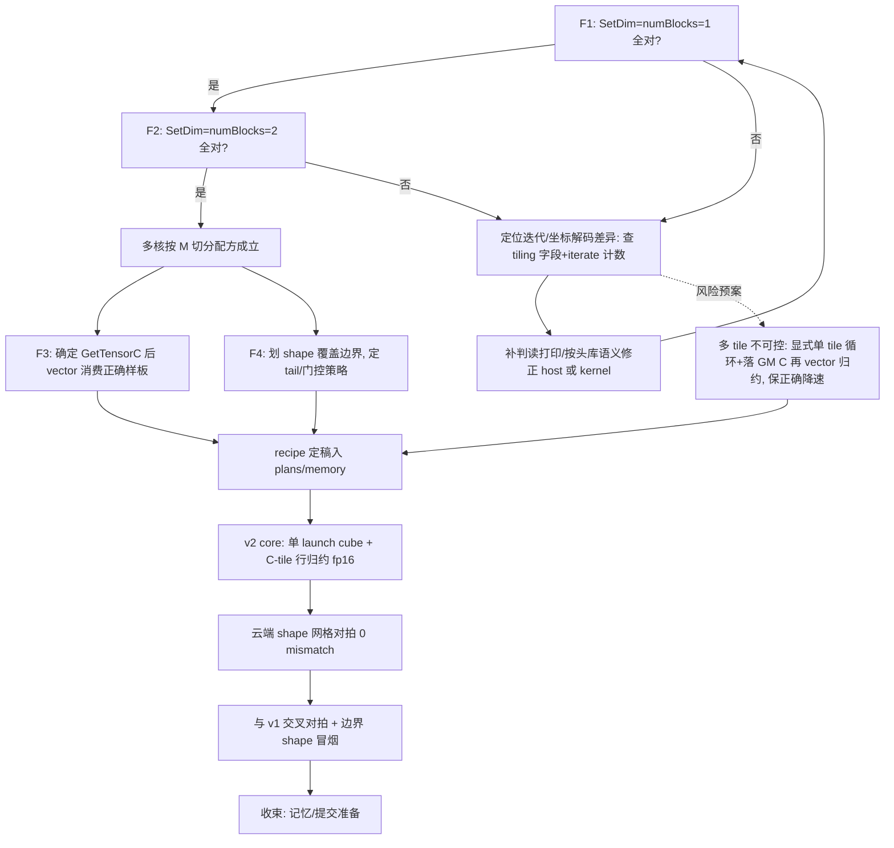

## 产品概述

延续 batch_matmul_max_sum 自定义算子（problem_1746）的攻坚：以「判题输出 100% 正确」为最高优先（速度再快，结果错也是 0 分），主攻 cube（Matmul 高级 API）路线取证，本轮覆盖 fp16 + transpose=false。

## 核心功能

- 修正记忆文件中关于评测机报错的错误归因：赛方已核实 `pipeline_submission.py` L208 `TypeError: a bytes-like object...` 为评测机自身缺陷，与提交算子运行无关；原「v1 在判题隐藏用例上异常/超时被强杀致管道崩溃」的结论作废，v1 真实判题分未知。
- 登记赛方提供的用例规模/时限信息（用户稍后补充），并按其修正验收基准。
- 打通 matmul 多 tile 迭代与坐标落位语义（取证 F 系列）：解释 off 蓝本"仅 4 个角 tile 正确、rows 512..1023 被单 block 写入"的反常现象；确定 grid(numBlocks) 与 tiling.SetDim 的正确匹配关系。
- 定性 GetTensorC 产物被 vector 算符紧随消费（mode1 插入 Abs 即出现 30 行 (K-1)/K 伪值）的队列/事件语义，找到正确样板写法。
- 摸清 cube 框架对 tail N（非 baseN 倍数，如 1000）、小 N、大 M/N、多核切分的真实覆盖边界。
- 取证收敛后实现 v2 核心：单 launch、cube 全量矩阵乘 + C-tile 内行方向归约（行和/行 max → y[b]，C 不落 GM），fp16/非转置，云端 shape 网格对拍 0 mismatch。
- 每阶段改动经静态核对后 git commit 并 push 上云跑验证，产出与结论沉淀进记忆与 plans。

## 技术栈

- Kernel：Ascend C（910B = **NPU_ARCH** 2201 / dav_c220，CANN 9.0.0）；Host：C++；编译/运行仅云端 CANN Lab（bisheng aarch64），本地 Windows 只做静态文本核对，不编译。
- 权威依据：`cann_ascendc_headers_9.0.0`（asc 树）> 官方教程/示例（03.05 matmul_abs 蓝本、04/05 matmul tiling 文档）> 笔记。
- 工程形态：延续 `cube_probe/` 目录式多探针可执行文件工程（CMake + run_probe.sh 一次云跑多个探针），不改动 v1 `kernel.asc`（仍是可回退的正确基线）。

## 实施方案

取证方法论：单变量隔离 + 指纹判读。数据沿用探针 E 构造（A[m][k]=m+1、B[k][n]=n+1、bias=0.5、golden=K(m+1)(n+1)+0.5），输出按 G/P/S/0/x 判型并统计 tile 网格级 rel-bad，错值 ≈10^7 放大即行错位指纹，(K-1)/K×邻行 = 少一 k 的部分和指纹。

### 实验矩阵（本轮取证）

- **F1/F2（off_matmul_abs.asc）**：kernel 逐字不动，host 按 argv 切换 (SetDim,numBlocks) ∈ {(1,1),(2,2),(2,1)基线}，M1024 N640 K256 fp16，全 C 对拍 + 40-tile 网格统计。验证：SetDim==numBlocks 时全 C 是否 100% 正确（F2 同时验证多核 M 切分无重叠/无空洞）；单 block 时 rows 512+ 被写来源（越界写 vs 框架隐式摊派）。
- **F3（cube_probe.asc 新 mode）**：针对 mode1 Abs 紧跟即错的时序问题，加 mode2 = GetTensorC→EnQue→DeQue→Abs→EnQue→DeQue→DataCopy（Abs 改为二次独立生产者）、mode3 = GetTensorC→Abs 但 Abs 前插 TQue 空 EnQue/DeQue 交替，对照 mode0（已知全对），判定：queue 交接序 vs 事件缺失 vs Abs 本身。
- **F4（shape_sweep.asc 新增）**：host 侧运行时循环 M/N/K（tiling 每 shape 重建 + launch + 全 C 对拍），覆盖 N∈{128,640,1000,16}、M∈{128,256,512}、K=256/256 非整除，dim/blocks 用 F1/F2 收敛出的正确配对，划出 cube 可覆盖 shape 边界（含 tail N 行为、极小 N 是否需 shape 门控）。
- **并行案头取证（research）**：用 code-explorer 在 host 端 matmul_tiling 头库与 03/04/05 教程中提取 Iterate/坐标解码/grid-dim 关系，形成与实验互证的配方草稿。

### 决策流（取证→v2）



### 实施注意

- 每次云跑前：探针改动仅限 cube_probe/ 内文件；kernel 在测 host 变量时保持逐字不动（隔离变量）；C 落 GM 前一律 aclrtMemsetAsync 清零（区分"未写"与"错写"）。
- 判读打印保持机器可读（逐行判型串 + 计数 + tile 网格），便于贴回对话直接分析。
- 本地"编译"仅限静态核对：API 签名先查 `cann_ascendc_headers_9.0.0`（GetTensorC/Iterate/Abs/DataCopy 已核实条目直接复用）；`.asc` 文件 0 lint 目标。
- 工程其余（kernel.asc v1、run.sh、scripts/）本轮不改；另一项目只读、cann 头库只读；git 提交覆盖 cube_probe 改动即可。
- 风险预案：若 F1-F4 表明多 tile 语义仅在特定配置可控，回退"每 batch 单 cube 块显式循环多 tile + DataCopy 落 GM C 后 vector 归约"（保正确、可接受降速），并如实写入记忆。

## 目录结构

```
.codebuddy/
├── memory/2026-09-07.md                     [MODIFY] L115-119 错误归因改写为赛方结论; 同步修正 L99 待办及相邻句中关联文案
├── memory/2026-09-08.md                     [NEW] 今日工作日志: 赛方用例规模/时限登记(用户补充后)、探针 F 结果与判读
├── memory/handoff_batchmatmulmaxsum_judge_2026-09-06.md [MODIFY] 若含同款 bytes 报错归因, 一并修正
└── plans/PLAN_1746_probe_F_matmul_multitile_2026-09-08.md [NEW] 取证设计+判读+recipe 备忘(随实验更新)

Projects/batchmatmulmaxsum_problem_1746_template/
├── kernel.asc                               [不改动] v1 正确基线(本轮只读)
└── cube_probe/
    ├── off_matmul_abs.asc                   [MODIFY] host 增 argv 选 (SetDim,numBlocks): F1(1,1)/F2(2,2)/(2,1)基线; kernel 不动; 输出加 40-tile 网格与行/列归属映射
    ├── cube_probe.asc                       [MODIFY] 增 mode2/mode3 消费时序变体(mode0/1 保留), 判读打印对齐既有 G/P/S/0/x 格式
    ├── shape_sweep.asc                      [NEW] 运行时 shape 循环探针: 每 shape 重建 tiling+launch+全 C 对拍, 覆盖 tail N/小 N/多核组合, 输出覆盖边界表
    ├── CMakeLists.txt                       [MODIFY] 增 shape_sweep 可执行目标(沿用既有 asc 工程模式)
    └── run_probe.sh                         [MODIFY] 追加 shape_sweep 运行段(保持逐探针独立可跑)
```

（v2 核心文件视取证结论再定：先在 cube_probe/ 内以独立可执行原型验证，验证通过后再移植为 kernel.asc 提交形态。）

## 关键代码结构

无需新增接口定义；沿用已核实的既有 API 形态：`Matmul::GetTensorC<true>(dst, 0, true)`（C 在 VECIN）、`Abs(dst, src, count)` 三参就地、`REGIST_MATMUL_OBJ`、MultiCoreMatmulTiling 各 Setter/GetTiling、DataCopy 128B 块 gap/pitch 语义（探针 E/R0-R2 已验证）。

## 子代理

- **code-explorer**
- 用途：在 CANN_Learning_Hub 03/04/05 教程与 host 端 matmul_tiling 头文件（cann_ascendc_headers_9.0.0）中挖掘多 tile 迭代总数、遍历顺序、坐标解码及 grid(dim) 关系，交叉核对 F 系列实验假设。
- 预期产出：可验证的"多 tile 正确使用配方"事实清单（含出处文件/行号），供 PLan 备忘与 v2 核心编码直接引用。